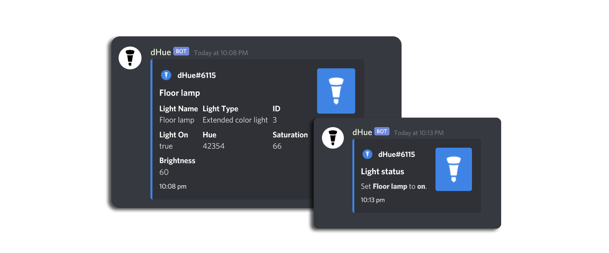

# 

## What is this?
**dHue** is an open source Discord Bot to control and manage **Philips Hue** smart lights all through discord. Built using [**discord.js**](https://github.com/discordjs/discord.js).

# 

## Features
- Turn lights off and on.
- Modify brightness and color.
- Detailed info about your Hue lights.

## How do I install this?
  Refer to the [wiki here](https://github.com/flyxn/dHue/wiki/Installation).
  
## Credits
  - Nortex#2978 for pretty much helping with the whole project.
  - maku#0001 for helping me with API issues.
  - FM-96#1504 for help with the turn command.
  - Hiekki#0001 for moral support.
  - sqmk for his awesome [Huejay](https://github.com/sqmk/huejay) client which without it this project would not have existed.
