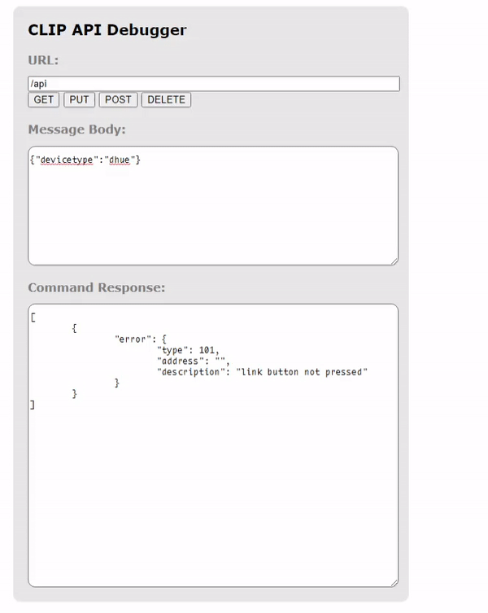

# 


### 💡 What is this?
dHue is an open source Discord Bot to control and manage Philips Hue smart lights all through discord. Built using [discord.js](https://github.com/discordjs/discord.js).

## ⌨️ Features
- Turn lights off and on.
- Modify brightness and color
- Detailed info about your Hue lights

## 🚗 Setup
1. Go to [https://discovery.meethue.com/](https://discovery.meethue.com/), and copy the internal bridge ip address value.
2. In the config folder, open config.js in a text editor and replace 'bridge_ip' with the ip address of your Hue bridge, for example: ```bridgeIp: 'xxx.xxx.x.xx',```
3. Open your web browser and paste in https://bridgeip/debug/clip.html, paste in the internal bridge address into where it says bridge ip. For example, ```https://xxx.xxx.x.xx/debug/clip.html```
  <details>
<summary> 4. Copy what I put in the url and body, and then press the button on your Hue bridge</summary>
  
# 
```{"devicetype":"dhue"}``` 
</details>

5. Once you've copied your username,


