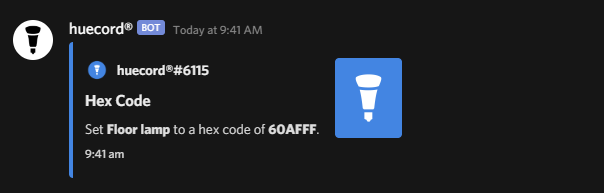

# 


## 💡 What is this?
**dHue** is an open source Discord Bot to control and manage **Philips Hue** smart lights all through discord. Built using [**discord.js**](https://github.com/discordjs/discord.js).

# 

### Features
- Turn lights off and on.
- Modify brightness and color.
- Detailed info about your Hue lights

## How do I install this?
  ```git clone https://github.com/flyxn/dHue```

### Hue Setup
1. Go to the [Meethue Discovery Page](https://discovery.meethue.com/), and copy the **internal bridge ip address** value.

2. In the config folder, open **config.js** in a text editor and replace ```'bridge_ip'``` with the ip address of your Hue bridge, for example: ```bridgeIp: 'xxx.xxx.x.xx',```

3. Open your web browser and paste in https://bridgeip/debug/clip.html, put your hue bridges **internal bridge address** into where it says bridge ip. For example, ```https://xxx.xxx.x.xx/debug/clip.html```

  <details>
<summary> 4. Copy what I put in the url and body, and then press the **button** on your Hue bridge</summary>

# 
</details>

5. Once you've copied your username, open **config.js** again and replace ```'bridge_username'``` with the username you copied. For example: ```bridgeUsername: '34bbtd7djQBAqRyZ52vMSvkWaMjPTFzRcOuBDTBs',```

### Discord Bot

1. Go to [https://discord.com/developers/applications](https://discord.com/developers/applications), and create a **new application**. Head to the **bot** section, and click **add bot**.

2. Copy the bot token, and paste this into ```'bot_token'``` in the config file. For example: ```token: 'xxxxxxxxxxxxxxxxxxxxxxxxxxxxxxxxxxxxxxxxxxxxxxxxxxxxxxxxxxx',```

#### Running the bot
1. Open up your **command prompt**, enter in ```cd``` and write out the path to your Huucord folder
      <details>
      <summary>Example</summary>

      ```cd C:\Users\name\Downloads\dHue-master\dHue-master```
      </details>

2. Make sure you have [**Node.JS**](https://nodejs.org/en/) installed or this won't work
      1.  type ```npm install```
      
3. Once all the packages have installed, type in your command prompt ```node .```

# 

### Bot Configuration
The bot's prefix **can** be changed by changing the ```botPrefix``` value

Owner only mode can be toggled in the config.js file. Owner only mode makes it so only certain people can use commands. To whitelist an ID, developer mode must be enabled from ```Settings -> Appearance```. Once developer mode is enabled, right click a user's name to get their ID. Replace ```ownerID``` in config.js with the ID of the user. If you want to whitelist multiple users, get the user's ID, then in ownerID in config, add a comma, then '', and put the ID in between the ''
        <details>
      <summary>Example</summary>
      ```ownerID: ['xxxxxxxxxxxxxxxxxx', 'yyyyyyyyyyyyyyyyyy'],```
      </details>


## Credits
  - **NorteX#2978** for pretty much helping with the whole project
  - **maku#0001** for helping me with API issues
  - **Hiekki#0001** for moral support
